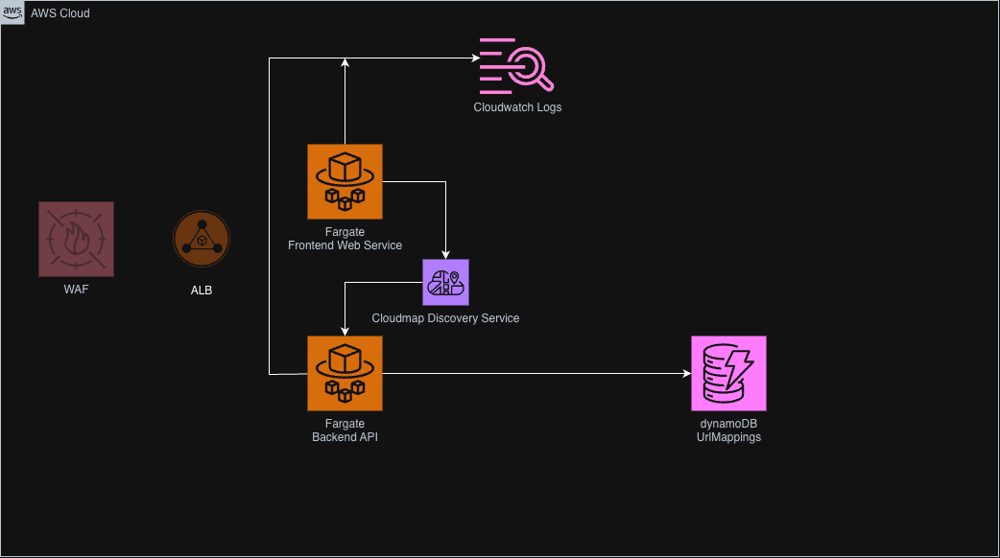

# Shorty

#  Cloud URL Shortener & Management Service

A resilient, cloud-native URL shortening platform built with a **Kotlin Ktor** backend, a **Node.js Express** frontend utilizing the **GOV.UK Design System (GDS)**, and **Amazon DynamoDB** for persistence.

The infrastructure is provisioned via **Terraform** on **AWS ECS Fargate**, featuring private service discovery via **AWS Cloud Map** and continuous deployment automated through **GitHub Actions**.

---

## Tech Stack

* **Backend:** Kotlin, Ktor, Koin (Dependency Injection), AWS Java SDK v2 (DynamoDbEnhancedClient), Gradle (ShadowJar)
* **Frontend:** Node.js 20, Express, Nunjucks, GOV.UK Frontend (GDS)
* **Cloud & Infrastructure:** AWS ECS (Fargate), Amazon DynamoDB, AWS Cloud Map (Service Connect / Private DNS), Amazon ECR, Amazon CloudWatch
* **Infrastructure as Code (IaC):** Terraform.
* **CI/CD:** GitHub Actions (`workflow_dispatch` manual redeployments + `push` triggers).

---

## Running Locally

The local development environment makes use of the DynamoDB Local container to prevent the need to access Dynamo on AWS

The below docker compose inlcudes Dynamo DB Local as well as a web administration interface for interacting with Dyanmo Local outside of the CLI

```bash
docker compose up --build
```

***Frontend UI:*** http://localhost:3000

***Backend API*** http://localhost:8080

***Dynamo Web UI*** http://localhost:8001


## Architecture Overview



**WAF and ALB** are excluded from this implementation due to cost of running, for a live system these would of course exist to offer security and balancing between the dynamic Fargate instances that come up

This represents a single region system at this stage, mutli-region would easily be possible through Dynamo Global Tables

The same is true for Fargate where containers could be deployed into desired regions, most likely based on usage for those regions

# Projected Cloud Costs

For a system that generates 100,000 hits per day, of which 80,000 are reads and 20,000 are new url generations the system would cost the following over a 30 day period

| AWS Service          | Size / Quantity                              | Cost (USD)          |
|----------------------|----------------------------------------------|---------------------|
| Fargate              | 2 Tasks (0.25 vVPU 0.5 GB RAM                | 18.42               |
| DynamoDB (On Demand) | 2.4M Read Units + 600K Write Units + Storage | 0.95                |
 | Cloud Map            | 1 Private namespace                          | 0.60                |
 | Cloudwatch Logs      | 2-3GB ingestion, 7 day retention             | 1.60                |
| Data Egress          | 15-20GB egress                               | 1.35                |
| ECR                  | 2 docker repos                               | 0.05                |
| **Total**            |                                              | **~$22.97 / month** |

This costs would likely vary slightly as I would not expect the Fargate service to be able to handle that much load with such low spec and instances but it serves as a projection

---
## Notable Omissions & Improvements

* Database actions are not truly asynchronous, this would cause an issue and high volume, moving to ```DynamoDbEnhancedAsyncClient``` would resolve this
* Consistency is entirely handled by DynamoDB at this point, this is fine but needs careful management if multi-region deployments and accelerators are implemented
* No pagination of results when performing table scan, all results in the table are returned from Dynamo, this is expensive on large scans in terms of performance and cost. Pagination should be implemented in order to provide a better front end experience to the user. This however, does not limit the financial cost of running a scan. In reality though, it is unlikely a production system would return all URLs
* Items should be deleted based on a TTL value set in the DB. This would be a design decision, links may wish to persist forever but that has cost and storage considerations, if links are deleted though we should determine if those aliases should be reused again
* Backend and Frontend tests are minimal and should be extended further
* The live system is slow due to the Fargate sizing, even for a single deployment this would need to be performance benchmarked
* The repo is injected into each route, this could be lifted further up
* Ktor has been used for the API, Spring Boot may have been preferable but this served as a good intro into Kotlin